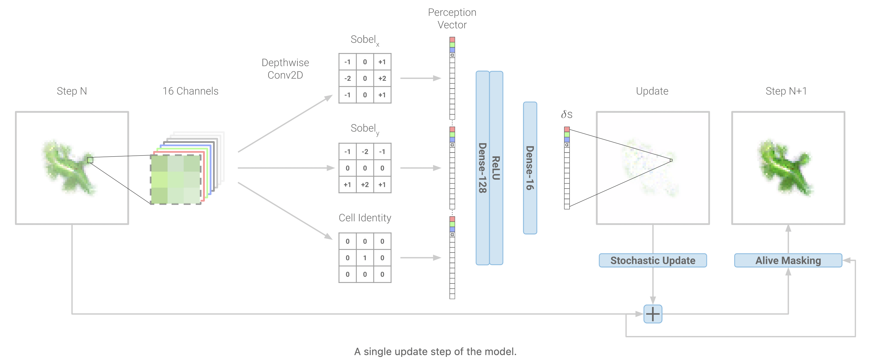
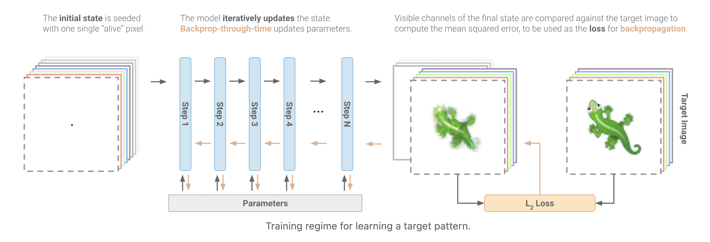

# Growing Neural Cellular Automata

Reimplementation of [Growing Neural Cellular Automata](https://distill.pub/2020/growing-ca/).

The concept is an extension of [_"Conway's game of life"_](https://en.wikipedia.org/wiki/Conway%27s_Game_of_Life), with a (almost) continuous set of updates.

The network takes in input the derivative with respect to the X-axis and to the Y-axis using Sobel filters in addition to the information of the pixel itself, and outputs a proposed update.

The generation then proceeds repeating this update for a certain amount of times, mimicking a ResNet with shared weights per residual block (or a recurrent network with a additive recurrent layer), to finally calculate a per-pixel regression loss, and back-propagate the gradient.

<small>Credits: all images taken from the <a href="https://distill.pub/2020/growing-ca/">original post</a></small>

## Model checkpoints

The `checkpoints-*` folders there are the TF checkpoints for the models for the generation of the thinking and the ghost emojis